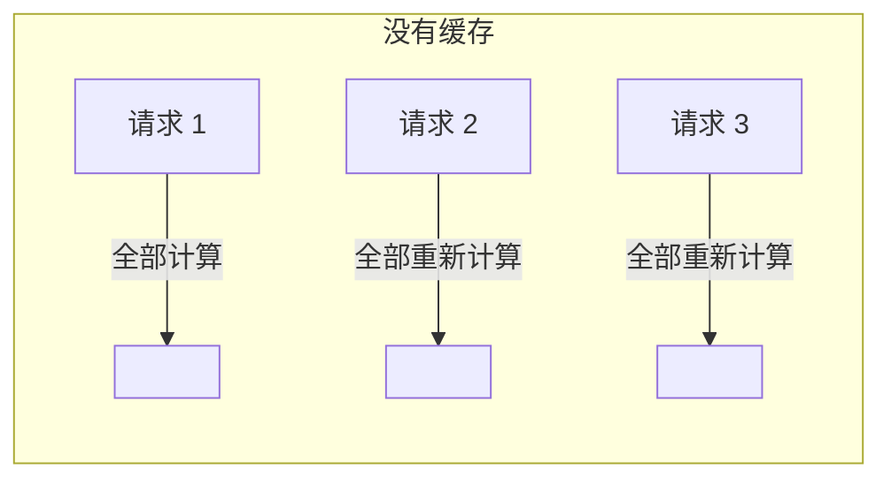
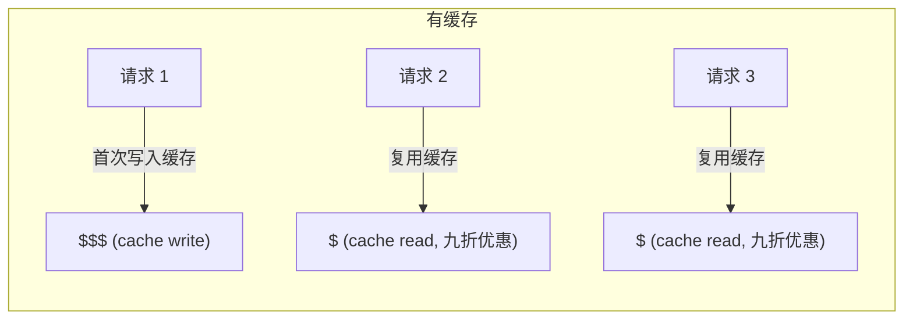
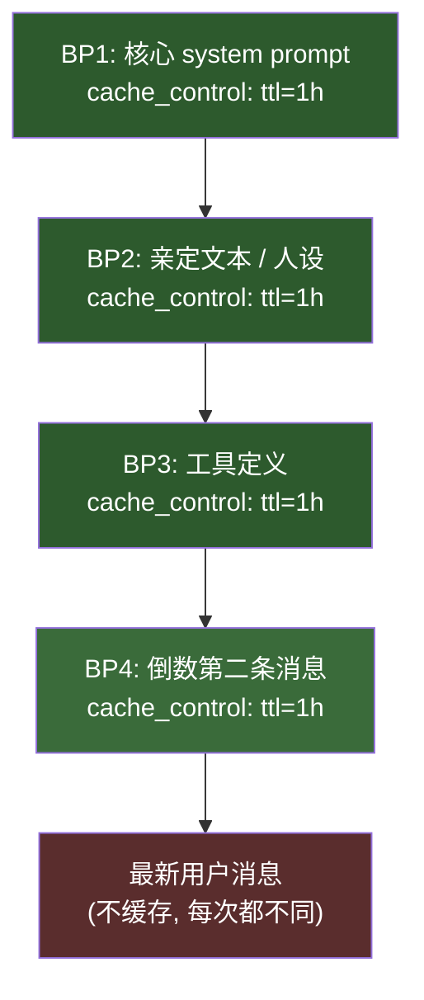
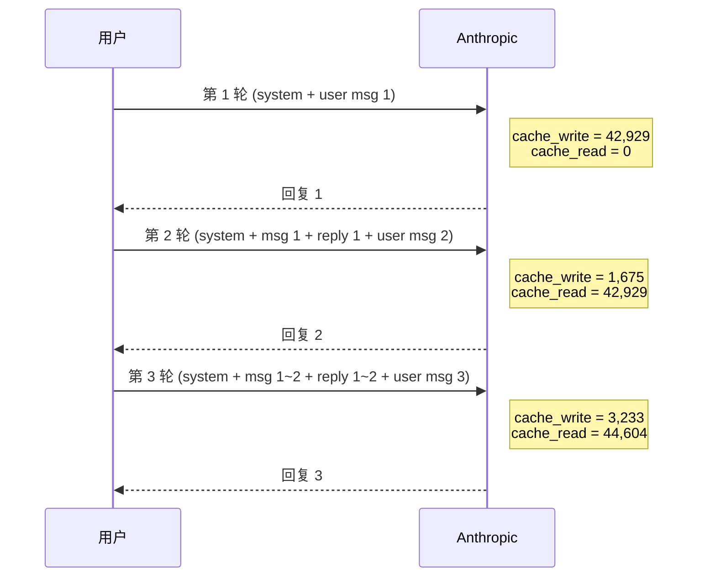
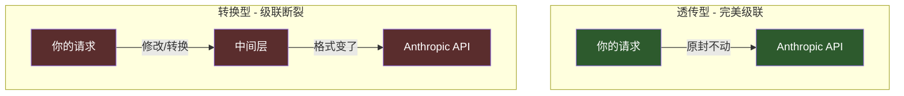
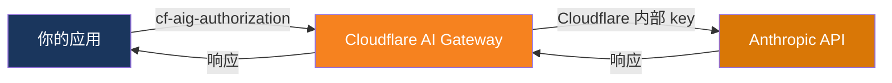

# Claude's Fermata

**延长记号** — Anthropic Claude Prompt Caching 保姆级教程

> Fermata 是音乐中的延长记号,表示将一个音符保持更长时间。
> 就像缓存把昂贵的计算结果"延长"住,不需要每次重新计算。

---

## 目录

- [什么是 Prompt Caching](#什么是-prompt-caching)
- [缓存断点怎么放](#缓存断点怎么放)
- [缓存级联](#缓存级联)
- [中转站缓存表现对比](#中转站缓存表现对比)
- [Cloudflare AI Gateway 接入](#cloudflare-ai-gateway-接入)
- [验证缓存是否命中](#验证缓存是否命中)
- [省钱计算](#省钱计算)

---

## 什么是 Prompt Caching

每次调用 Claude API,Anthropic 服务器都需要"读"一遍你发过去的全部内容(system prompt + 对话历史)。内容越长,花的钱越多。

**Prompt Caching** 是 Anthropic 提供的服务端缓存机制:把你请求中不变的前缀部分缓存起来,下次请求只要前缀一样,就直接复用,不用重新计算。





### 关键概念

| 概念 | 说明 |
|------|------|
| `cache_control` | 标记缓存断点的字段,告诉 Anthropic "到这里为止可以缓存" |
| `cache_creation_input_tokens` | 本次请求新建了多少 token 的缓存 |
| `cache_read_input_tokens` | 本次请求复用了多少 token 的缓存 |
| TTL | 缓存存活时间,默认 5 分钟,可延长到 1 小时 |

### 最低 Token 门槛

不是所有请求都能触发缓存,每个模型有最低 token 数量要求:

| 模型 | 最低缓存 Token 数 |
|------|-------------------|
| Claude Opus 4 | 1,024 |
| Claude Sonnet 4 | 1,024 |
| Claude Haiku 3.5 | 2,048 |

> 你的 system prompt + 对话前缀必须超过这个数,缓存才会生效。

---

## 缓存断点怎么放

缓存断点通过 `cache_control` 字段标记。你可以在 system prompt 或 messages 中的任意内容块上加这个字段。

### 基本用法

在 system prompt 的最后一个内容块上添加 `cache_control`:

```json
{
  "model": "claude-opus-4-6",
  "max_tokens": 4096,
  "system": [
    {
      "type": "text",
      "text": "你是一个助手。以下是你需要遵循的规则...(很长的文本)...",
      "cache_control": { "type": "ephemeral" }
    }
  ],
  "messages": [
    { "role": "user", "content": "你好" }
  ]
}
```

### 启用 1 小时 TTL

默认缓存只活 5 分钟。要延长到 1 小时,需要:

**第一步**: 在请求头中加入 beta 标记:

```
anthropic-beta: extended-cache-ttl-2025-04-11
```

**第二步**: 在 `cache_control` 中指定 TTL:

```json
"cache_control": { "type": "ephemeral", "ttl": "1h" }
```

> 注意: `ttl: "1h"` 的断点必须放在 `ttl: "5m"` (或不指定 TTL)的断点**前面**。
> 如果你把 1h 的放在 5m 的后面,API 会报错。

### 多断点策略

实际使用中,通常会设置多个缓存断点(Breakpoint, 简称 BP):



**为什么倒数第二条消息也要加断点?**

因为对话每增加一轮, 之前的所有消息都不会变。在倒数第二条消息上加断点, 可以确保之前的整段对话历史都被缓存, 只有最新一条消息需要重新计算。

---

## 缓存级联

缓存级联(Cache Cascading)是缓存的高级形态,也是省钱的关键。

### 什么是级联?

每一轮对话,缓存都在上一轮的基础上"接力":



### 完美级联的数字特征

```
轮 1: read=0,      write=42,929  -> total=42,929
轮 2: read=42,929,  write=1,675   -> total=44,604
轮 3: read=44,604,  write=3,233   -> total=47,837
```

每一轮的 `cache_read` 精确等于上一轮的 `total`(read + write), 说明之前的所有内容都被完整复用, 只有新增的对话内容产生了 `cache_write`。这就是**完美级联**。

### 级联断裂

如果中转站或代理修改了请求体的任何部分(哪怕改一个字), Anthropic 服务端的缓存 key 就对不上, 级联就会断裂:

```
轮 1: read=0,      write=42,929
轮 2: read=0,      write=44,604   <- 全部重新写入, 没有复用!
轮 3: read=0,      write=47,837   <- 继续全部重新写入
```

> 级联断裂意味着每一轮都在付全价写入缓存, 完全失去了缓存的意义。

---

## 中转站缓存表现对比

不同的 API 中转站/代理对缓存的支持程度不同, 核心区别在于**是否透传请求体**:



### 各类型对比

| 类型 | 级联表现 | 原因 |
|------|----------|------|
| **Anthropic 官方直连** | 完美级联 | 无中间层 |
| **透传型中转站** (如使用 Anthropic 直连 key 的中转站) | 完美级联 | 请求体原封不动到达 Anthropic |
| **CF AI Gateway** (原生 Anthropic 端点) | 完美级联 | 透传代理, 不修改请求体 |
| **OpenRouter** | 级联断裂 | 可能重写 model 名、加前缀、走转换层 |
| **compat 兼容端点** | 级联断裂 | OpenAI 格式与 Anthropic 格式互转, 破坏 cache_control |

> 关键判断标准: 中转站有没有动过你的请求体。任何修改都会导致 Anthropic 的缓存 key 变掉。

---

## Cloudflare AI Gateway 接入

Cloudflare AI Gateway 是一个透明代理, 可以在不持有 Anthropic 官方 API key 的情况下使用 Claude API, 并且支持完美级联缓存。

### 架构概览



### 第一步: 注册 Cloudflare 账号

1. 前往 [dash.cloudflare.com](https://dash.cloudflare.com) 注册
2. 登录后进入控制台

### 第二步: 创建 AI Gateway

1. 左侧菜单找到 **AI** > **AI Gateway**
2. 点击 **Create Gateway**
3. 输入 Gateway 名称(例如 `my-gateway`)
4. 创建完成后记下你的 Gateway URL

Gateway URL 格式:
```
https://gateway.ai.cloudflare.com/v1/{account_id}/{gateway_name}/anthropic
```

### 第三步: 获取 CFUT Token (Unified Billing)

1. 在 AI Gateway 页面找到 **Billing** 或 **Unified Billing**
2. 开启 Unified Billing(Cloudflare 代付, 收 5% 手续费)
3. 生成 CFUT Token, 格式为 `cfut_` 开头的字符串

> Unified Billing 模式下你不需要 Anthropic 官方 API key, Cloudflare 替你付费。

### 第四步: 发起请求

CF Gateway 的认证方式与直连 Anthropic 不同:

| | 直连 Anthropic | CF Gateway (CFUT) |
|---|---|---|
| 认证头 | `x-api-key: sk-ant-xxx` | `cf-aig-authorization: Bearer cfut_xxx` |
| 端点 | `https://api.anthropic.com/v1/messages` | `https://gateway.ai.cloudflare.com/v1/{id}/{name}/anthropic/v1/messages` |

**请求示例:**

```bash
curl https://gateway.ai.cloudflare.com/v1/YOUR_ACCOUNT_ID/YOUR_GATEWAY/anthropic/v1/messages \
  -H "cf-aig-authorization: Bearer cfut_YOUR_TOKEN" \
  -H "anthropic-version: 2023-06-01" \
  -H "anthropic-beta: extended-cache-ttl-2025-04-11" \
  -H "Content-Type: application/json" \
  -d '{
    "model": "claude-opus-4-6",
    "max_tokens": 1024,
    "system": [
      {
        "type": "text",
        "text": "你是一个助手...(长文本)...",
        "cache_control": { "type": "ephemeral", "ttl": "1h" }
      }
    ],
    "messages": [
      { "role": "user", "content": "你好" }
    ]
  }'
```

### 重要注意事项

1. **必须用原生 Anthropic 端点** (`/anthropic/v1/messages`), 不能用 compat 端点 (`/compat/chat/completions`), 否则缓存不透传
2. **CFUT 不支持 `/v1/models`**: 你无法通过 CF Gateway 拉取模型列表, 需要手动填写模型名(如 `claude-opus-4-6`)
3. **模型名用 Anthropic 官方名**: CF Gateway 是透明代理, 模型名与 Anthropic 官方一致
4. **接入代码需适配认证头**: 如果你的代码里写死了 `x-api-key`, 需要检测 `cfut_` 前缀并切换为 `cf-aig-authorization`

### 代码适配示例 (Node.js)

```javascript
// 根据 key 前缀自动选择认证头
function buildAuthHeaders(apiKey) {
  if (apiKey && apiKey.startsWith('cfut_')) {
    // CF Gateway Unified Billing
    return { 'cf-aig-authorization': 'Bearer ' + apiKey };
  }
  // 直连 Anthropic 或透传型中转站
  return { 'x-api-key': apiKey };
}

// 使用
const headers = {
  'Content-Type': 'application/json',
  ...buildAuthHeaders(apiKey),
  'anthropic-version': '2023-06-01',
  'anthropic-beta': 'extended-cache-ttl-2025-04-11',
};
```

---

## 验证缓存是否命中

每次 API 响应的 `usage` 字段中会包含缓存相关的信息:

```json
{
  "usage": {
    "input_tokens": 8,
    "output_tokens": 150,
    "cache_creation_input_tokens": 42929,
    "cache_read_input_tokens": 0
  }
}
```

### 怎么看

| 字段 | 含义 |
|------|------|
| `cache_creation_input_tokens` > 0 | 有新内容被写入缓存(首次或新增部分) |
| `cache_read_input_tokens` > 0 | 有内容从缓存中读取(省钱了!) |
| 两者都为 0 | 缓存没有生效(检查 token 是否达到最低门槛、断点是否正确) |

### 完美级联的判断方法

连续几轮对话, 观察:

```
轮 N:   cache_read = X
轮 N+1: cache_read = X + 轮N的cache_creation
```

如果每一轮的 `cache_read` 都等于上一轮的 `cache_read + cache_creation`, 恭喜你, 你的缓存在完美级联。

### 5 分钟 vs 1 小时 TTL 验证

1. 发一个请求, 记录 `cache_creation_input_tokens`
2. 等 **6 分钟**
3. 发一个完全相同的请求
4. 如果 `cache_read_input_tokens` > 0, 说明 1h TTL 生效了(默认 5 分钟早就过期了)

---

## 省钱计算

### 缓存定价 (以 Claude Opus 4 为例)

| 类型 | 每百万 token 价格 | 相比原价 |
|------|-------------------|----------|
| 普通输入 (无缓存) | $15.00 | 基准价 |
| 缓存写入 (cache write) | $18.75 | 贵 25% |
| 缓存读取 (cache read) | $1.50 | **便宜 90%** |

### 什么时候划算?

缓存写入比普通输入贵 25%, 但读取便宜 90%。只要你对同一个前缀发起 **2 次以上**请求, 就开始省钱:

```
无缓存 2 次:   $15.00 x 2 = $30.00
有缓存 2 次:   $18.75 x 1 (写入) + $1.50 x 1 (读取) = $20.25
节省:          $9.75 (32.5%)
```

对话越多轮, 省得越多。10 轮对话:

```
无缓存 10 次:  $15.00 x 10 = $150.00
有缓存 10 次:  $18.75 x 1 + $1.50 x 9 = $32.25
节省:          $117.75 (78.5%)
```

### 1 小时 TTL 的价值

默认 5 分钟 TTL 意味着你 5 分钟内不说话, 缓存就过期了, 下一次要重新写入。
1 小时 TTL 让缓存存活 12 倍时间, 大幅减少了重新写入的次数。

> 对于聊天场景, 1h TTL 几乎是必须的 — 谁会每 5 分钟都不间断地发消息呢?

---

## FAQ

### Q: CF Gateway 的 response cache 和 Anthropic 的 prompt cache 是一回事吗?

**不是**, 完全是两个独立的机制:

- **Anthropic prompt cache**: 缓存推理中间状态(KV cache), 相同前缀不用重新计算。即使对话内容不同, 只要前缀一样就能命中。
- **CF Gateway response cache**: 缓存完整响应, 只有**完全相同的请求**才命中。改一个字就 miss。

对聊天场景, 有用的是 prompt cache(每次消息不同但前缀相同)。response cache 基本不会命中。

### Q: 为什么 OpenRouter 的缓存级联会断?

OpenRouter 在中间大概率修改了请求体(重写 model 名、加前缀、格式转换等)。任何修改都会让 Anthropic 的缓存 key 不匹配, 导致级联断裂。

### Q: 我用的中转站能不能完美级联?

看你的中转站是否**透传** Anthropic 原生格式。简单判断: 如果你的请求格式是 Anthropic 原生的(`/v1/messages`), 且中转站声称是"直连 key", 大概率支持。拿不准就看 `usage` 数据验证。

---

## License

MIT

---

> Claude's Fermata - 让每一个 token 都被记住
